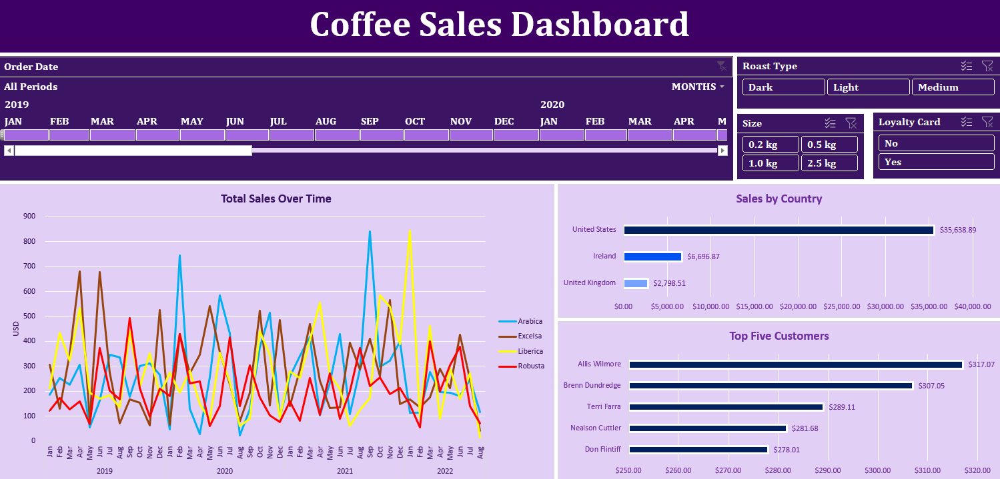

# ☕ Coffee Sales Dashboard – Excel

### *Exploring sales trends by coffee type, country, and customer segments*

This project is built using Microsoft Excel and showcases an interactive dashboard designed to help analyze coffee sales data. The dashboard provides insights into trends across time, and customer behavior — useful for making decisions related to product performance and market segmentation.

---

## 📊 Dashboard Preview

---

## 📂 About the Analysis

The dashboard helps answer key business questions like:

- How do total sales trend over time?
- Which countries contribute the most to revenue?
- Who are the top customers?
- How do roast type, size, and loyalty card membership affect sales?

### Main Components:

- **Timeline slicer** to filter data across specific months and years
- **Pivot tables** and **pivot charts** used to power all visuals
- **Interactive slicers** for:
  - Roast Type (Dark, Light, Medium)
  - Size (0.2 kg – 2.5 kg)
  - Loyalty Card (Yes / No)
- **Line chart** for total sales over time, split by coffee type (Arabica, Robusta, Liberica, Excelsa)
- **Bar chart** for country-level sales  
- **Bar chart** highlighting the top 5 customers by total spend

---

## 🧠 Tools & Techniques

- **XLOOKUP** – to enrich the orders table with customer and product details  
- **Structured Table** – created from order data for clean referencing  
- **Pivot Tables** – for summarizing sales metrics  
- **Slicers & Timeline** – for interactivity  
- **Custom Formatting & Layout** – for a visually engaging dashboard  

---

## 🎥 Dashboard Walkthrough (Video)

A short screen recording demonstrates the dashboard in action:

https://github.com/user-attachments/assets/e8734cd2-3dd3-43bb-af5a-e89f46181b66

---

## 🗂 File Structure

- `Coffee_Sales_Dashboard.xlsx` – Excel file containing raw data, pivot tables, and dashboard  
- `Coffee_Sales_Dashboard.png` – Dashboard preview screenshot  

---

## 📌 How to Use

1. Download the `.xlsx` file from this repository.
2. Open it in Microsoft Excel (preferably 2016 or newer).
3. Interact with slicers and timeline to explore the dashboard.

---

## 🔗 Data Source

- [Coffee Orders Dataset – Mo Chen](https://github.com/mochen862/excel-project-coffee-sales/blob/main/coffeeOrdersData.xlsx)

---
